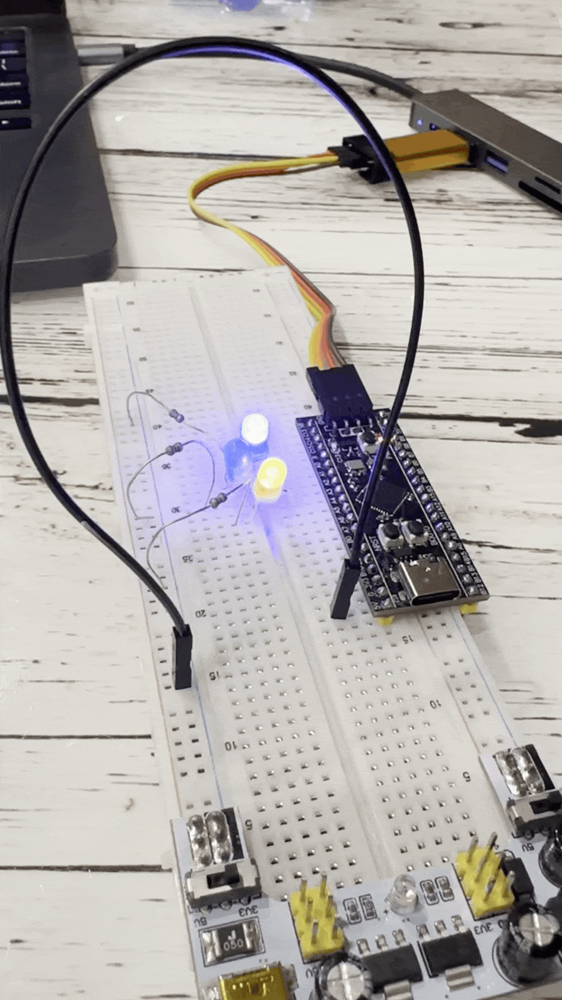
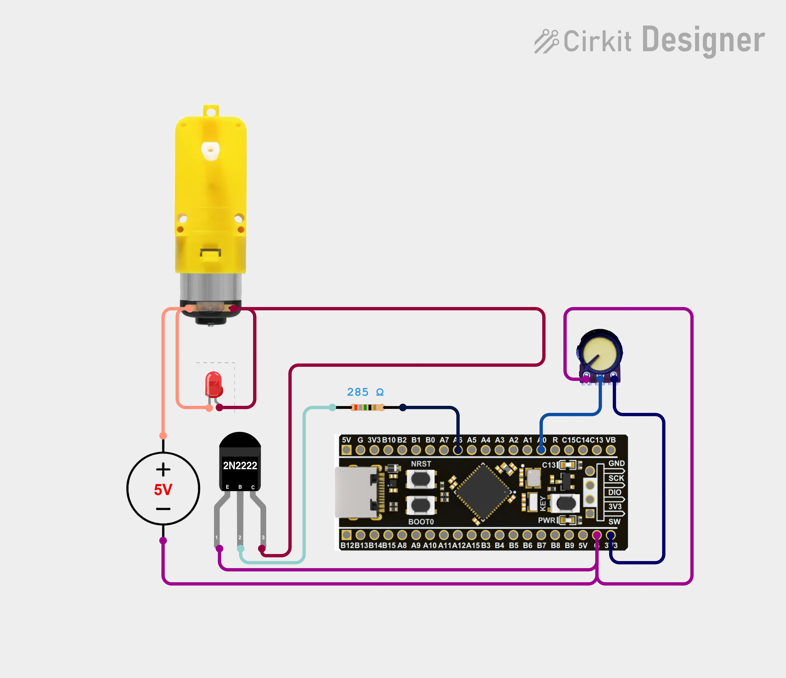

# stm32-playground

A bunch of learning projects using STM32F411 Black Pill developemt board.

- [Pinout](https://deepbluembedded.com/wp-content/uploads/2024/03/STM32F411CE-Black-Pill-Board-Pinout-Diagram.png);

## Lesson 22 - pwm-driven motor with varying speed

This project includes a motor controlled from stm32. Motor is connected to 3.3v power supply through a transistor, base of which is connected to the stm32. stm32 uses PWM to give signal to transistor's base, controling motor's rotation speed.

PWM is implemented programmatically, using STM32's timer. Timer calls a callback every 10us and we store a counter, which decides if it is time to toggle PWM. PWM's duty cycle is controlled by a potentiometer, value of which is read using ADC.

## Demo

## Circuit

