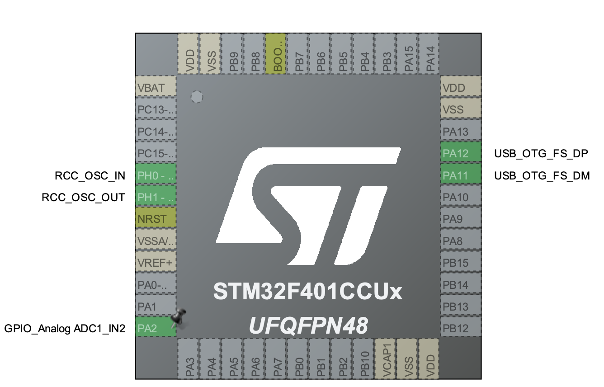
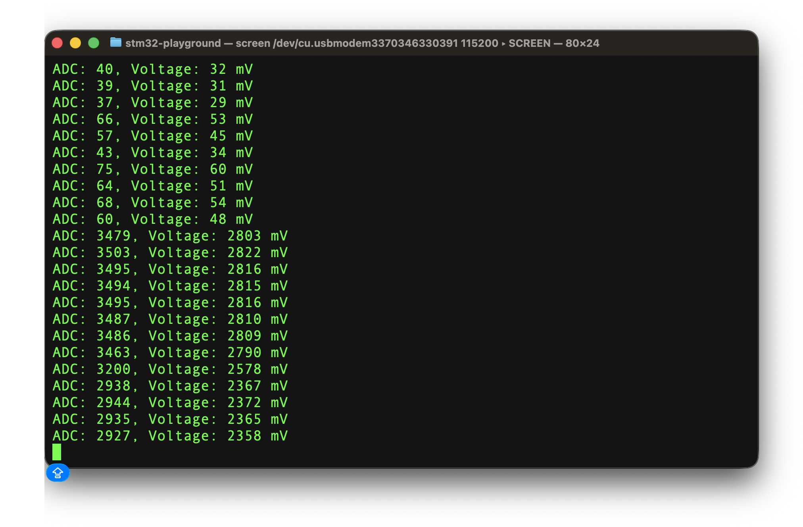

# stm32-playground

A bunch of learning projects using STM32F411 Black Pill developemt board.

- [Pinout](https://deepbluembedded.com/wp-content/uploads/2024/03/STM32F411CE-Black-Pill-Board-Pinout-Diagram.png);

## STM32 ADC converter experiment

- Voltage divider circuit that uses voltage divider;
- A2 STM pin set in analog read mode;
- USB-powered debugger to display messages on developer's machine;

## STM32CubeMX Setup

- PA2 pin set in "analog read" mode with ADC;
- PH0 and PH1 used for high-speed clock to enable USB message bus for debugging;
- PA11 and PA12 used for USB message bus debugger;

## Demo

The observed voltage increase happened because of switching on the room lights.

## Circuit

