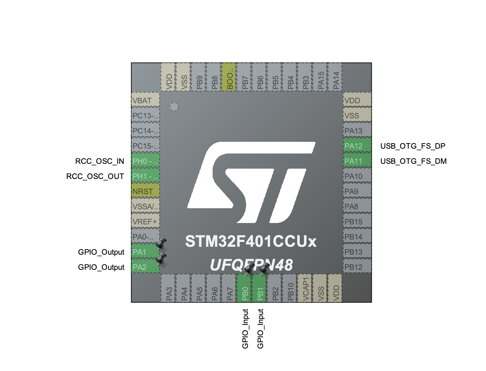

# stm32-playground

A bunch of learning projects using STM32F411 Black Pill developemt board.

- [Pinout](https://deepbluembedded.com/wp-content/uploads/2024/03/STM32F411CE-Black-Pill-Board-Pinout-Diagram.png);

### STM32 Dual-LED Controller

A small STM32 hobby project demonstrating non-blocking timing, debounced button input, multiple operating modes, USB CDC logging, and safe separation between generated STM32CubeMX code and application code.

Source code at: `/led-btn-pattern/Core/Src/main.c`

## Project highlights

- Built for an STM32F411-based board
- Firmware uploaded and debugged through ST-LINK using SWD
- USB CDC virtual serial port used for runtime logging
- Two LEDs controlled in opposite states
- Two buttons used to switch between operating modes
- Non-blocking LED timing based on `HAL_GetTick()`
- Software button debouncing without blocking the main loop
- Two-button combination detection with a short timing window
- Three operating modes - click button 1 to activate slow blinking mode, click button 2 to activate fast blinking mode, click both buttons to trigger an accelerating mode

### STM32CubeMX Setup

### Demo

