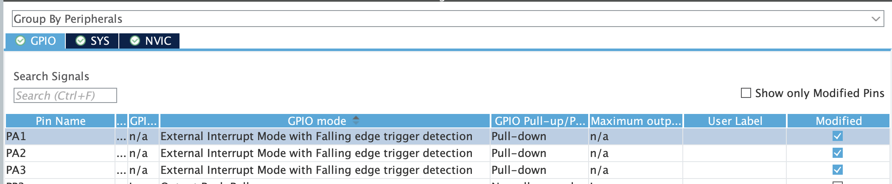
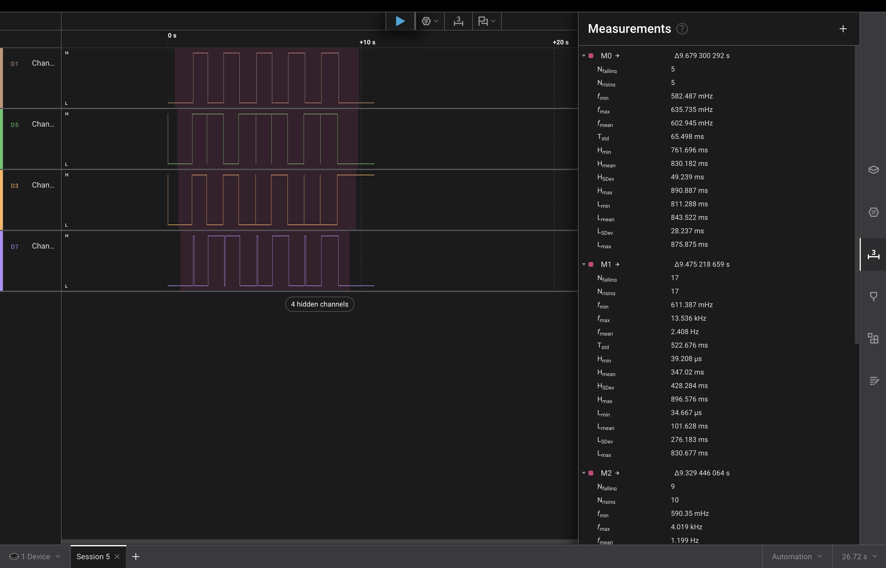
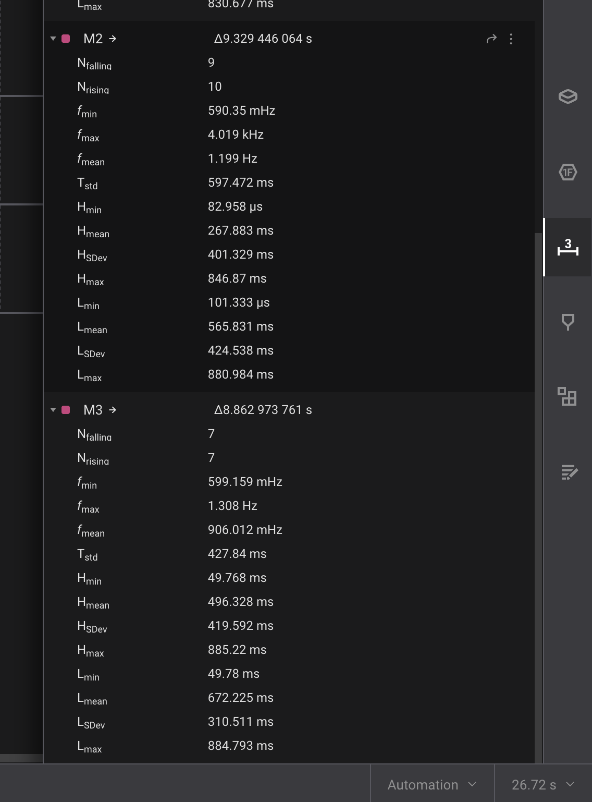

# stm32-playground

A bunch of learning projects using STM32F411 Black Pill developemt board.

- [Pinout](https://deepbluembedded.com/wp-content/uploads/2024/03/STM32F411CE-Black-Pill-Board-Pinout-Diagram.png);

## Lesson 24: STM32 debounce techniques

### Fritzing

STM32 ports A1, A2, A3, A4 with internal pulldown listen to button presses. Pins B3, B4, B5, B6 respectively are triggered as digital output on button presses, and we feed their output into logical analyzer.

### STM32CubeMX setup

Input pins were configured in GPIO_EXTI mode to handle interrupts. We set them in pulldown mode to avoid using external resistors, and we create EXTI interrupts in NVIC.

Output pins are just GPIO_Output.

We also configure TIM2 clock with 15999 prescaller and 49 counter value. The math behind this is, we want clock to tick every 1ms and emit every 50ms to implement debounce delay.

### Task comments

Task 1:
`shouldPin1Toggle` is set to `true` in GPIO input IRC, superloop polls for `shouldPin1Toggle==true` and toggles output pin.

Task 2:

GPIO input IRC triggers clock, forcing it to emit its own IRC in 50ms. In there we set `shouldPin2Toggle=true`, superloop polls for `shouldPin2Toggle==true` and toggles output pin.

Task 3:

`shouldPin13oggle` is set to `true` in GPIO input IRC, superloop polls for `shouldPin3Toggle==true` and toggles output pin. Along the way, it also checks current pin state using `HAL_GPIO_ReadPin`. This task was done verbatim - "fixate event in ICR, check state in superloop", but for it to really work we probably need some delay. I did not go this road, because task 2 implementation seemed cleaner.

Task 4:

`updateButton4State` is an improvised state machine function, being called on every main loop iteration and checking btn state with respect to state variables and rules.

### Runtime behaviour

D3 - task 1
D7 - task 2
D5 - task 3
D1 - task 4

Each button was pressed 10 times. That means, ideally, we should have seen 5 rises and 5 falls, because button press triggers a toggle. The only implementation that consistently fought off debounvce was task 4, I had high hopes for task 2 and it did present good results simetimes, but it was prone to bounce anyways. I might play around with timing to make it work better later.

 

### Comparison

| Method | False positives                 | Latency                  | Complexity                                                                 | Comments                                             |
|--------|---------------------------------|--------------------------|----------------------------------------------------------------------------|------------------------------------------------------|
| Task 1 | 19 events for 10 actual toggles | Negligible               | Low (apart from MX configuration)                                          | Not usable for real projects                         |
| Task 2 | 14 events for 10 actual toggles | 50ms for clock interrupt | Low-to-medium                                                              | Should be usable for real projects after fine-tuning |
| Task 3 | 34 events for 10 actual toggles | Negligible               | Low (but can probably be made better using tick-based non-blocking delays) | Should be usable for real projects after fine-tuning |
| Task 4 | 10 events for 10 toggles        | 50ms                     | Medium                                                                     | Usable for real projects                             |

Task 5 (hardware debounce) will be implemented as a part of lesson 26, because ESP32 has a bit better developer experience, and hardware part means it is not attached to the specific MCU.