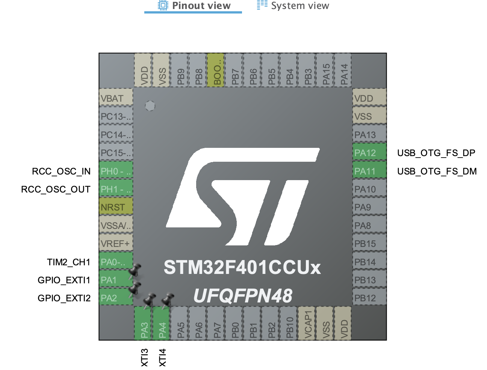
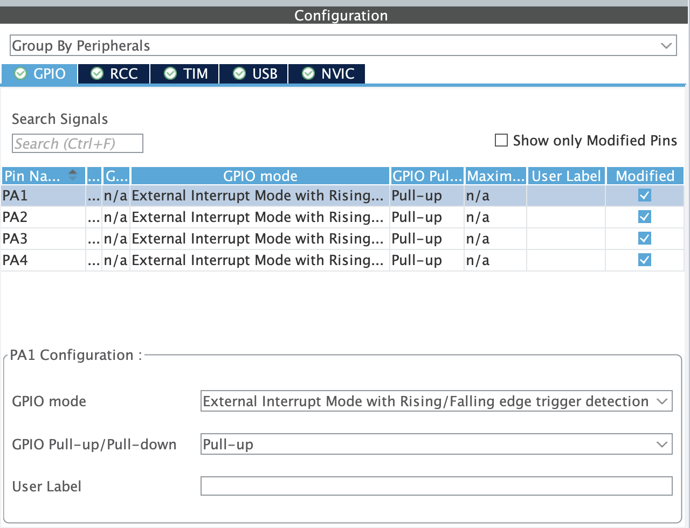
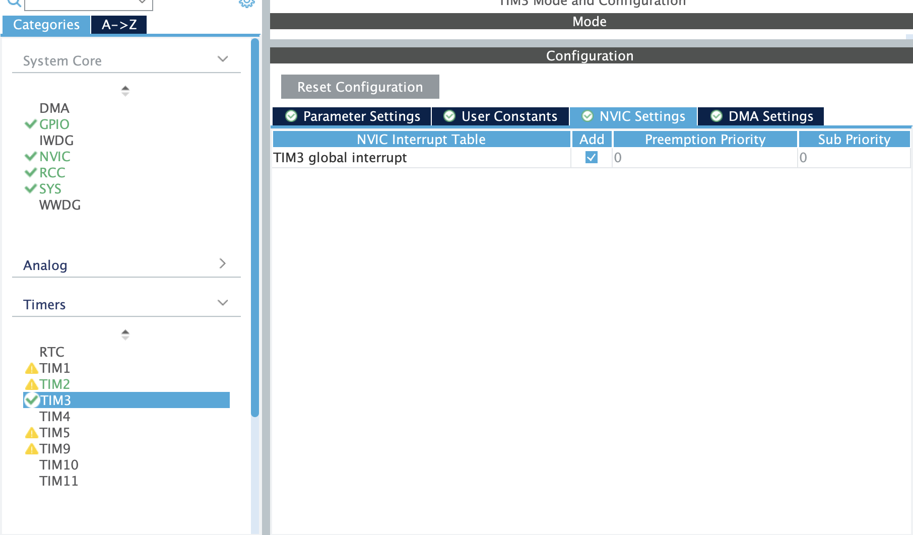
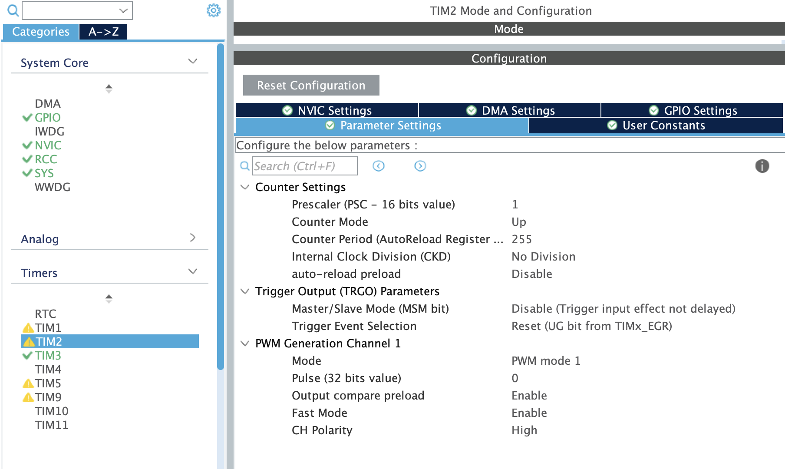

# stm32-playground

A bunch of learning projects using STM32F411 Black Pill developemt board.

- [Pinout](https://deepbluembedded.com/wp-content/uploads/2024/03/STM32F411CE-Black-Pill-Board-Pinout-Diagram.png);

## Lesson 33: buzzer

### STM32CubeMX project

GPIOA1-4 respond for button listeners. They are configured to listen for both rising and falling edge interrupts, with internal pull-up.

Timer TIM2 listens to PWM, timer TIM3 is used to alter signal value according to the required frequency.

### Fritzing

### Business logic

When powered, STM32 will play nokia tune using a non-blocking state machine. It will compare current time to the note duration, deciting where it is time to switch notes, stop sending a signal to the buzzer or start another iteration of a loop.

As soon as it detects first buzzer press, state machine updates are paused using a volatile boolean flag. After that, button presses apply their own frequency value on the buzzer.

In idle mode, buzzer plays a Nokia tune. On button presses, user is able to play "Smoke on the water" main riff.

### Demo 1: Nokia tune idle mode

### Demo 2: Smoke on the water riff