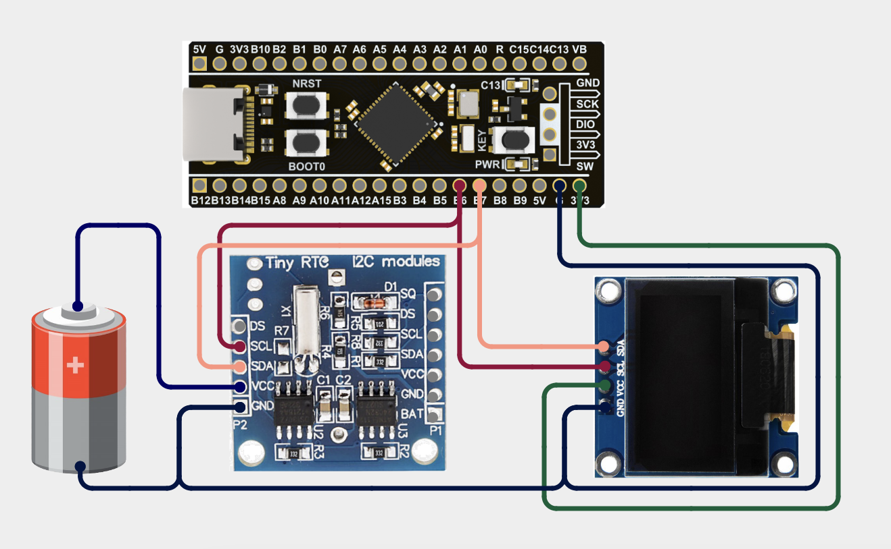
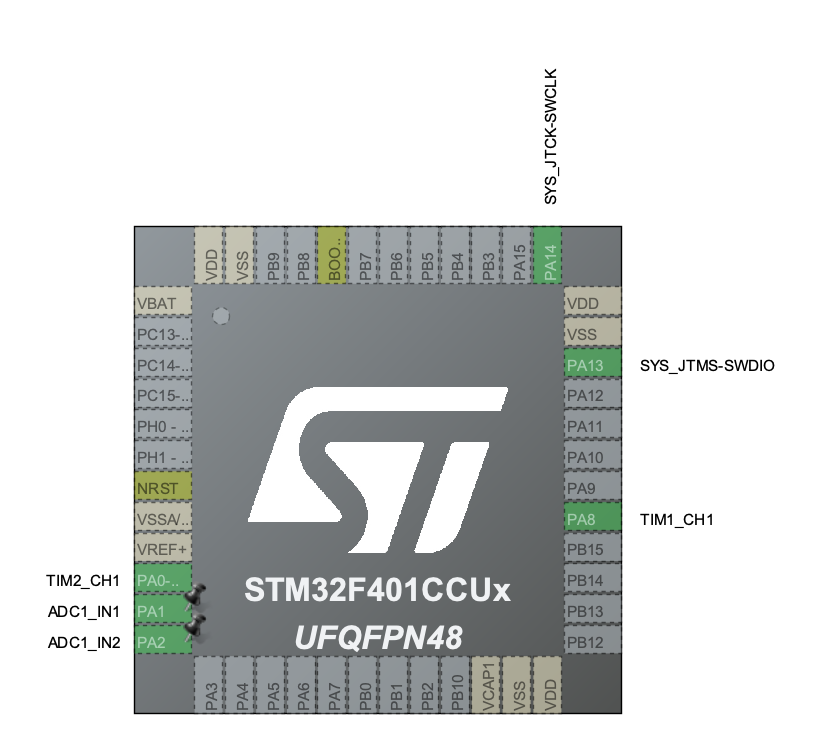
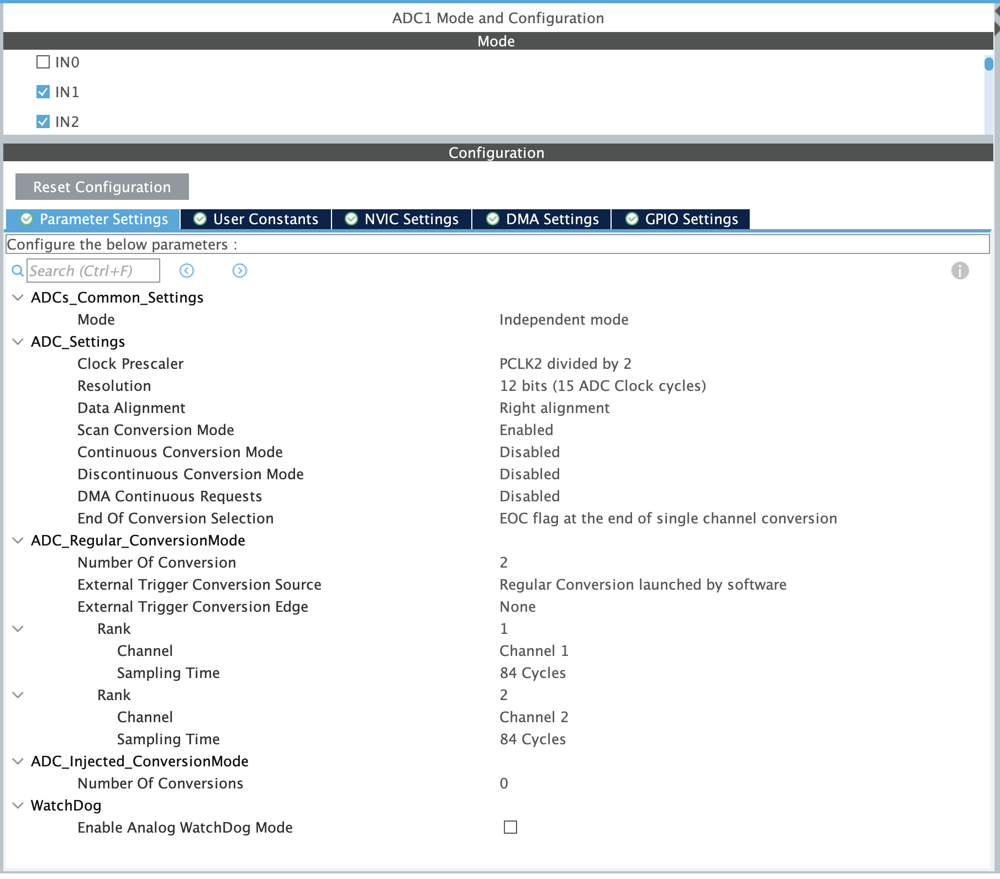
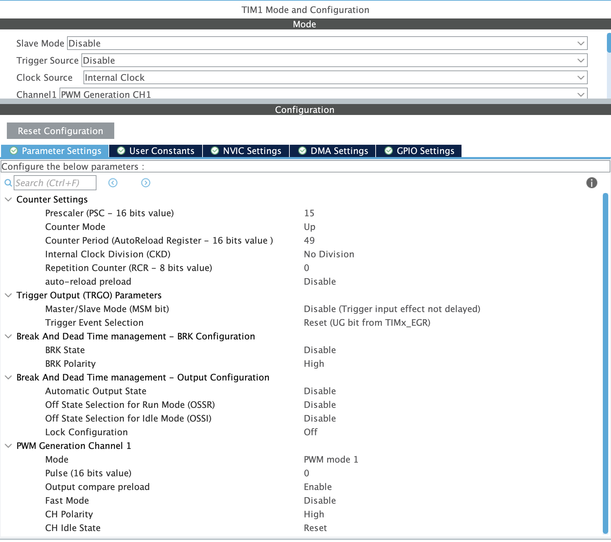
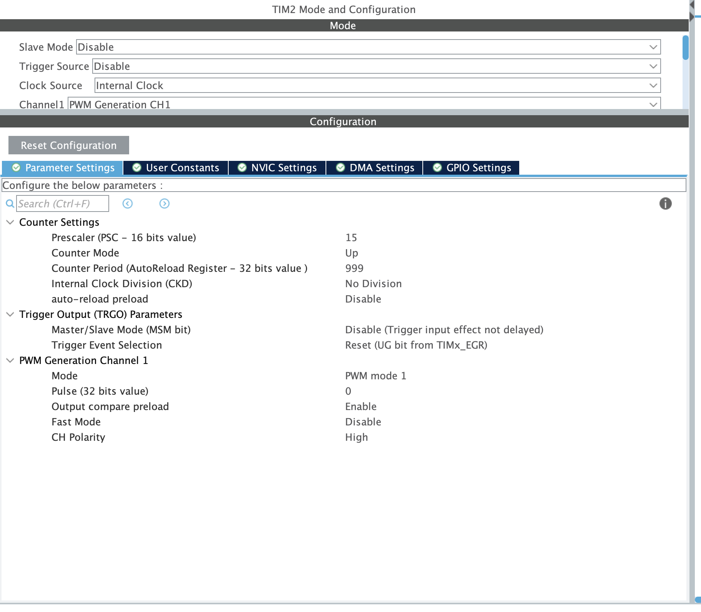
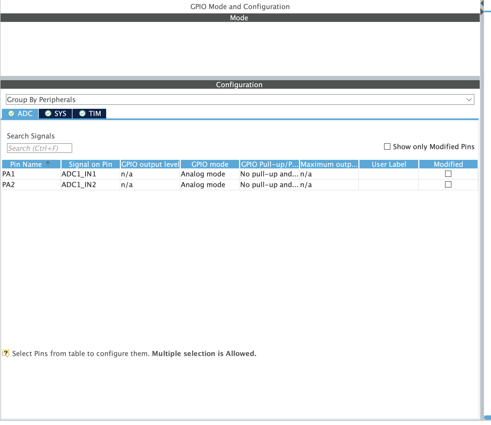
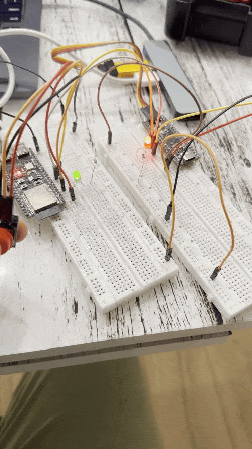

# stm32-playground

A bunch of learning projects using STM32F411 Black Pill developemt board.

- [Pinout](https://deepbluembedded.com/wp-content/uploads/2024/03/STM32F411CE-Black-Pill-Board-Pinout-Diagram.png);

## Lesson 32: autonomous hardware PWM

This lesson revolves around using two different potentiometers+ADC and two different devices powered by PWM. The idea is to test out the MCU emitting two different and independent PWM patterns.

### Fritzing

### STM32CubeMX project

### Project description

To let user set duty cycle, we have two separate potentiometers. STM32 reads to their value using a builtin ADC1 - it listems to A1 and A2 pins, reading values in 12-bit resolution. To listen to multiple pin inputs, ADC1 is configured to have 2 conversions in its parameter settings. At this point, STM32 and its firmware is able to read two values, each from 0 to 4095.

To implement PWM, timers TIM1 and TIM2 are set. Both have 15 as their prescaler value, to set timer frequency as 1 MHz. Timer that controls LED has 999 counter mode to let us have 1 kHz frequency, and timer that controls DC motor has 49 counter to have 20kHz value. Both timers use their channels to output generated PWM - PA8 and PA0 respectively.

As for the firmware, we simply have an infinite loop that polls for ADC value, comverts it to duty cycle value and sets it, changing the way listening devices operate. LED has a varying brightness, motor speeds up or slows down.

### Demo

