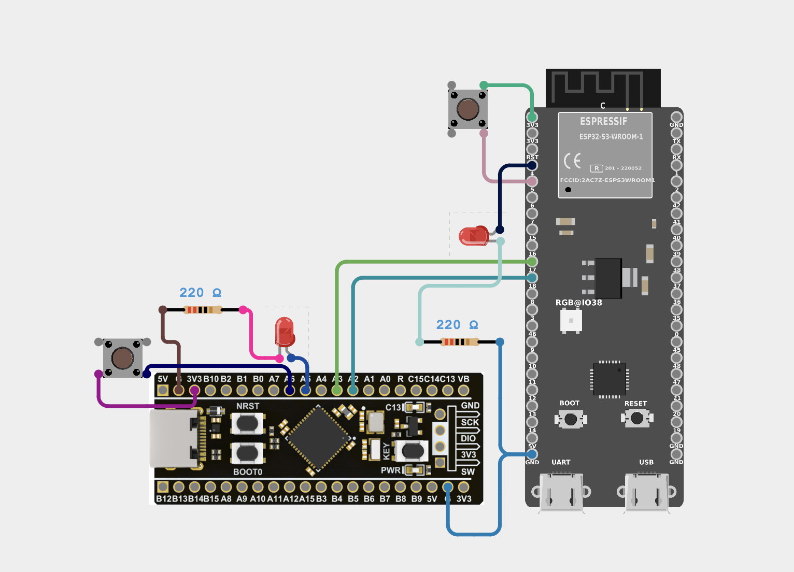

# stm32-playground

A bunch of learning projects using STM32F411 Black Pill developemt board.

- [Pinout](https://deepbluembedded.com/wp-content/uploads/2024/03/STM32F411CE-Black-Pill-Board-Pinout-Diagram.png);

## Lesson 40: UART

Connect ESP32 and STM32 together. Each MCU has its own button, LED and UART connection. ESP button press triggers STM led and vice versa. To communicate LED state, ASCII '1' and '0' are used. UART is configured to have 9-bit messages with 1 parity bit.

### Pinout

### Demo

